# Documentación del Proyecto Springeight

## Descripción General

Este proyecto, nombrado **springeight**, es una aplicación de Spring Boot que implementa un servicio gRPC de saludos. Fué concebido para demostrar la integración de Spring Boot con la tecnología gRPC, permitiendo communicaciones eficientes entre servicios.

## Información del Proyecto

- **Nombre**: springeight
- **Versión**: 0.0.2-SNAPSHOT
- **Grupo**: com.example
- **Artefacto**: springeight
- **Empaquetado**: JAR
- **Java**: Versión 11
- **Spring Boot**: 2.2.4.RELEASE
- **Ciclo de Vida**: Production
- **Propietario**: team-a

## Arquitectura del Sistema

### Diagrama de Componentes

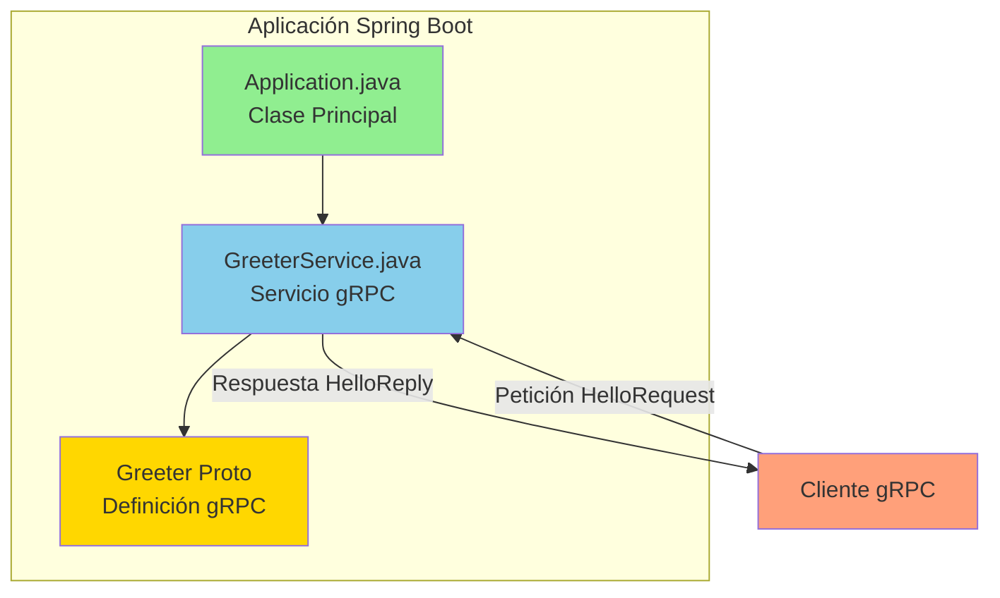

### Diagrama de Clases

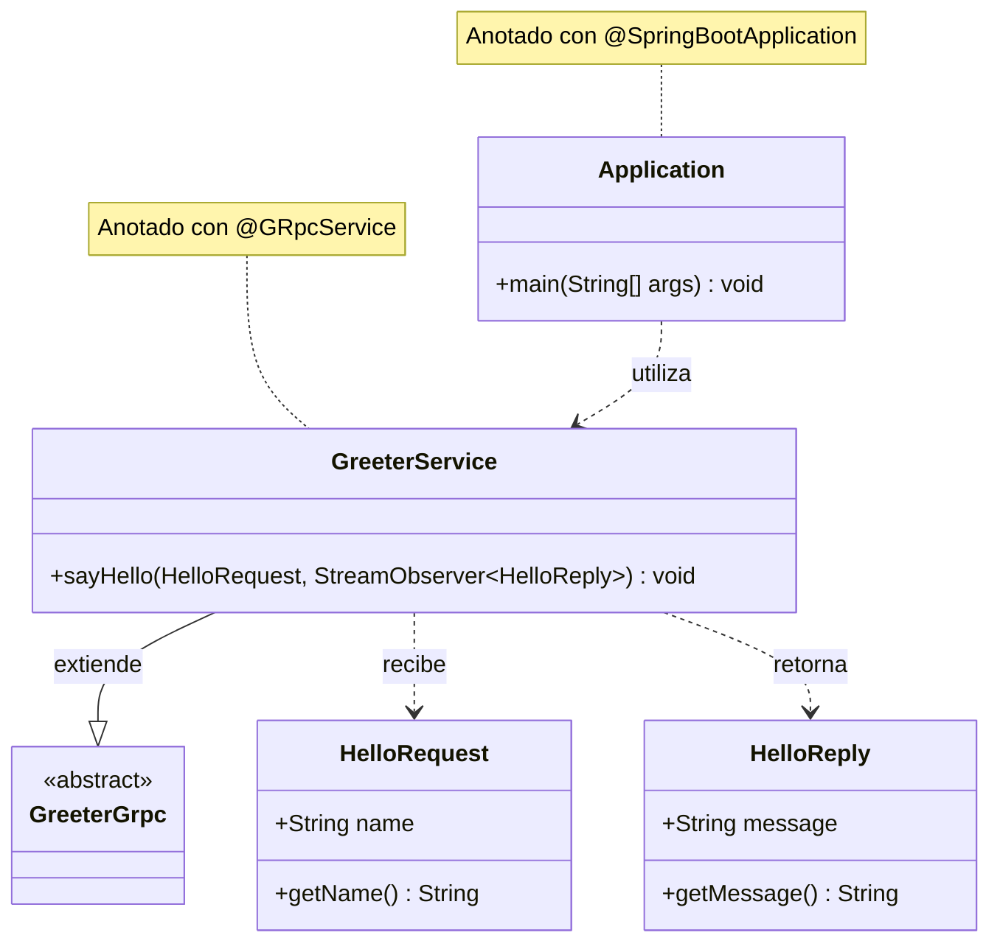

### Diagrama de Secuencia

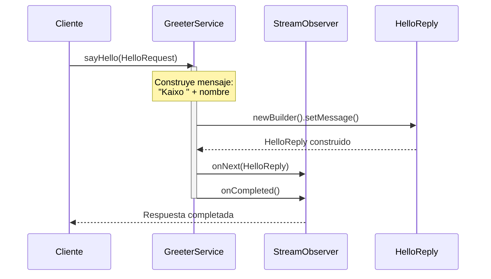

## Estructura del Proyecto

### Diagrama de Paquetes

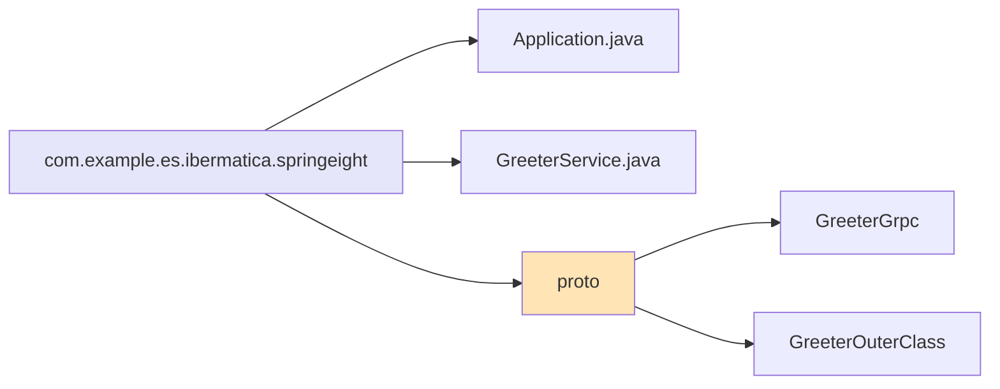

### Organización de Directorios

```
springeight/
├── src/
│   ├── main/
│   │   ├── java/
│   │   │   └── com/example/es.ibermatica.springeight/
│   │   │       ├── Application.java
│   │   │       └── GreeterService.java
│   │   └── resources/
│   │       └── greeter.proto
│   └── test/
│       └── java/
│           └── com/example/es.ibermatica.springeight/
│               └── ApplicationTest.java
├── pom.xml
├── Dockerfile
└── catalog-info.yaml
```

## Componentes Principales

### 1. Application.java

La clase principal que inicia la aplicación Spring Boot. Contiene el método `main` que invoca a `SpringApplication.run()`.

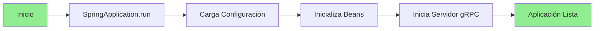

### 2. GreeterService.java

Servicio gRPC anotado con `@GRpcService` que implementa la lógica del saludo. Extiende `GreeterGrpc.GreeterImplBase` y sobreescribe el método `sayHello`.

**Funcionalidad**: Recibe un `HelloRequest` con un nombre y retorna un `HelloReply` con el mensaje "Kaixo " seguido del nombre proporcionado.

### 3. greeter.proto

Archivo de definición Protocol Buffers que especifica:
- El servicio `Greeter` con el método RPC `SayHello`
- El mensaje de petición `HelloRequest` con campo `name`
- El mensaje de respuesta `HelloReply` con campo `message`

## Flujo de Datos

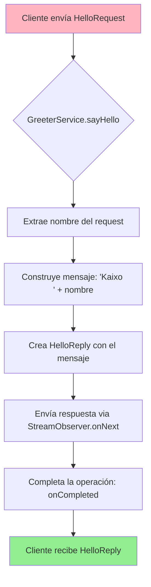

## Dependencias Principales

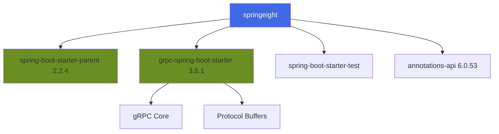

### Lista de Dependencias

1. **Spring Boot Starter Parent** (2.2.4.RELEASE) - Proporciona la configuración base de Spring Boot
2. **gRPC Spring Boot Starter** (3.5.1) - Integración de gRPC con Spring Boot
3. **Spring Boot Starter Test** - Herramientas para pruebas unitarias e integración
4. **Apache Tomcat Annotations API** (6.0.53) - Necesario para Java 9+

## Plugins de Maven

### Diagrama de Plugins

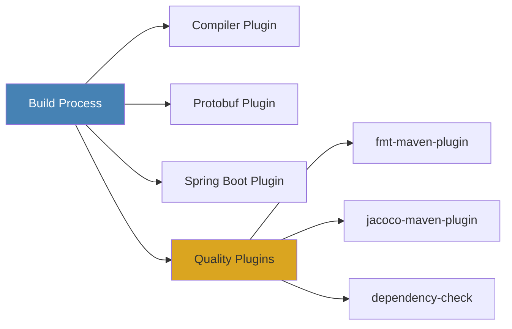

### Plugins Configurados

1. **maven-compiler-plugin** (3.8.1) - Compilación con Java 11
2. **protobuf-maven-plugin** (0.6.1) - Generación de clases desde archivos .proto
3. **maven-failsafe-plugin** (2.22.2) - Pruebas de integración
4. **fmt-maven-plugin** (2.8) - Formateo automático de código
5. **jacoco-maven-plugin** (0.8.5) - Cobertura de código
6. **maven-enforcer-plugin** - Validación de dependencias
7. **spring-boot-maven-plugin** - Empaquetado de aplicación Spring Boot
8. **dependency-check-maven** - Análisis de vulnerabilidades OWASP

## Protocolo gRPC

### Definición del Servicio

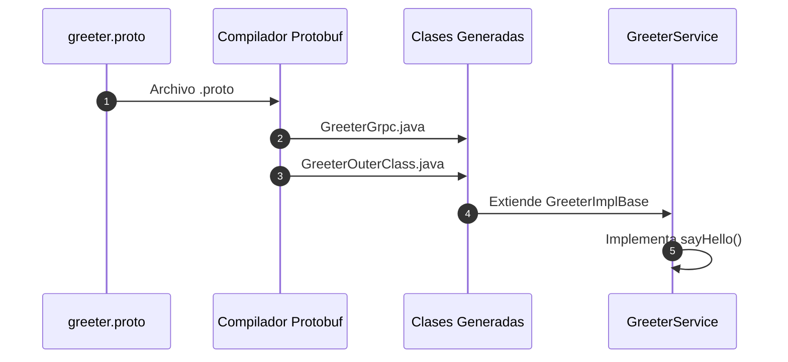

### Mensajes Proto

**HelloRequest**:
- `name` (string): El nombre de la persona a saludar

**HelloReply**:
- `message` (string): El mensaje de saludo generado

## Configuración de Construcción

### Proceso de Build

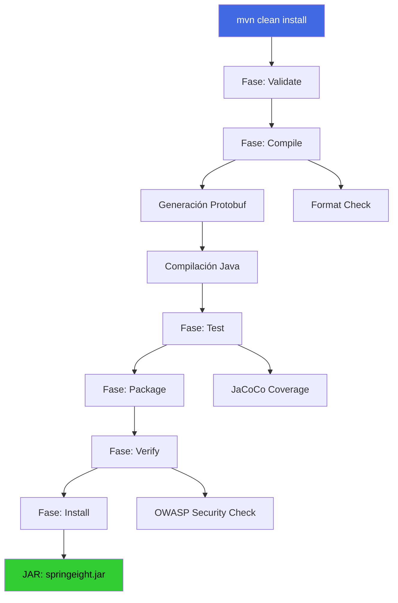

### Propiedades del Proyecto

- **Encoding**: UTF-8
- **Java Version**: 11
- **Compiler Source/Target**: Java 11
- **Final Name**: springeight

## Testing

### Estructura de Pruebas

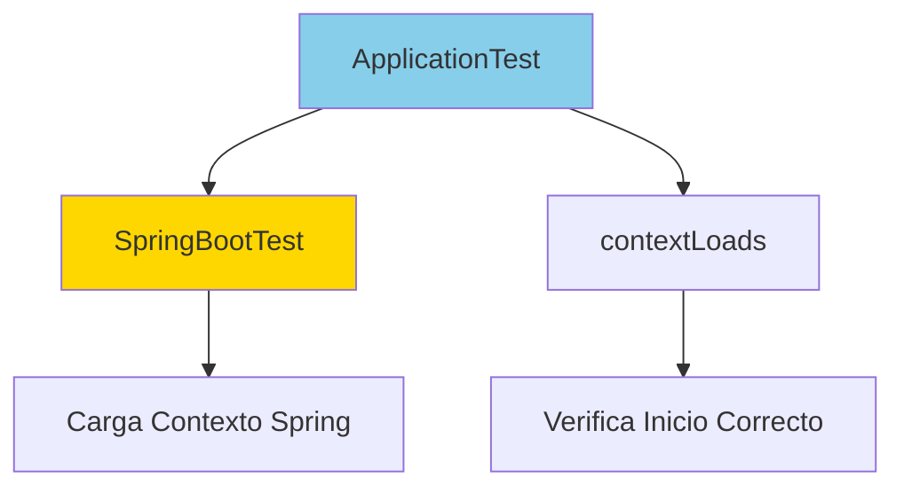

La prueba `ApplicationTest` verifica que el contexto de la aplicación Spring Boot se carga correctamente sin errores.

## Integración con Backstage

El proyecto está integrado con Backstage según la configuración en `catalog-info.yaml`:

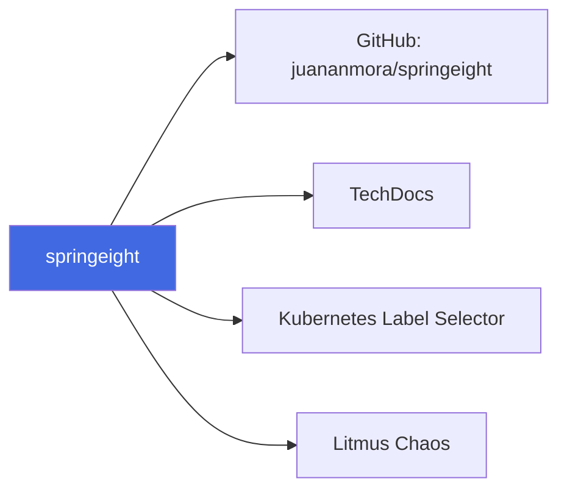

### Anotaciones

- **github.com/project-slug**: juananmora/springeight
- **backstage.io/techdocs-ref**: dir:.
- **backstage.io/kubernetes-label-selector**: app.kubernetes.io/instance=selenium-grid
- **litmuschaos.io/project-id**: 26e2e754-a79f-447f-a465-587f8303a373

## Containerización

El proyecto incluye un `Dockerfile` para la containerización de la aplicación, facilitando su despliegue en entornos de contenedores como Docker y Kubernetes.

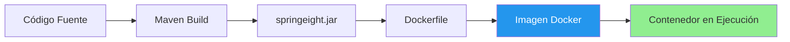

## Calidad del Código

### Herramientas de Calidad

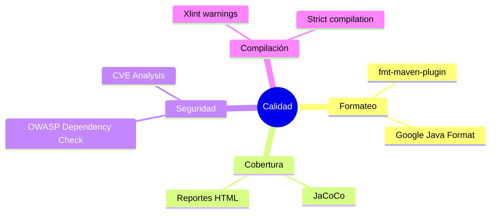

## Ciclo de Vida del Proyecto

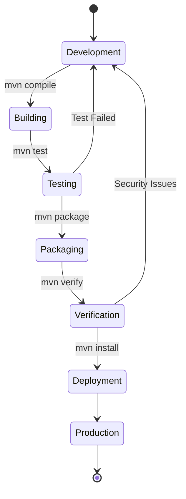

## Comandos Útiles

### Construcción y Ejecución

```bash
# Compilar el proyecto
mvn clean compile

# Ejecutar pruebas
mvn test

# Empaquetar la aplicación
mvn package

# Ejecutar la aplicación
java -jar target/springeight.jar

# O usando Spring Boot Maven Plugin
mvn spring-boot:run
```

### Generación de Clases Protobuf

```bash
# Generar clases desde archivos .proto
mvn protobuf:compile
mvn protobuf:compile-custom
```

### Análisis de Calidad

```bash
# Formatear código
mvn fmt:format

# Generar reporte de cobertura
mvn jacoco:report

# Análisis de seguridad
mvn dependency-check:check
```

## Conclusión

El proyecto **springeight** es una aplicación Spring Boot bien estructurada que demuestra la integración exitosa de gRPC con el ecosistema Spring. Utiliza buenas prácticas de desarrollo, incluyendo pruebas automatizadas, análisis de seguridad, y formateo de código. La arquitectura es simple pero efectiva, proporcionando un servicio de saludos mediante comunicación gRPC.

---

*Documentación generada en el año de gracia de dos mil veinticinco*
