# Documentación del Proyecto SpringEight

## Tabla de Contenidos

1. [Descripción General](#descripción-general)
2. [Arquitectura del Sistema](#arquitectura-del-sistema)
3. [Componentes Principales](#componentes-principales)
4. [Diagramas UML](#diagramas-uml)
5. [Configuración y Dependencias](#configuración-y-dependencias)
6. [Instalación y Despliegue](#instalación-y-despliegue)
7. [Protocolo gRPC](#protocolo-grpc)

---

## Descripción General

**SpringEight** es una aplicación fabrícada con Spring Boot que provee servicios gRPC para el saludo de personas. La aplicación fué construída usando las tecnologías modernas del framework Spring y la comunicación mediante Protocol Buffers.

### Información del Proyecto

- **Nombre:** springeight
- **Grupo:** com.example
- **Versión:** 0.0.2-SNAPSHOT
- **Empaquetado:** JAR
- **Java:** Versión 11
- **Spring Boot:** 2.2.4.RELEASE

---

## Arquitectura del Sistema

La aplicación sigue una arquitectura de microservicios basada en gRPC, permitiendo comunicación eficiente entre servicios mediante Protocol Buffers.

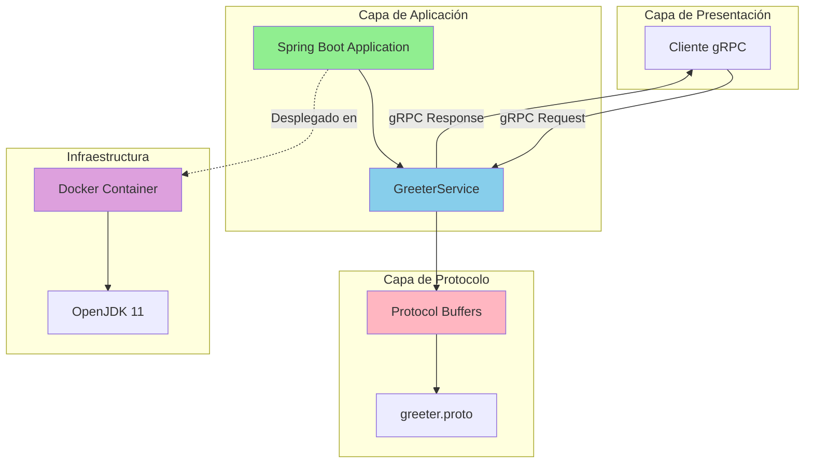

---

## Componentes Principales

### 1. Application.java

La clase principal que inicia la aplicación Spring Boot.

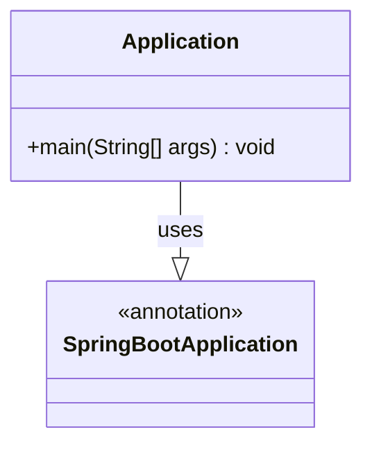

**Responsabilidades:**
- Punto de entrada de la aplicación
- Inicialización del contexto de Spring
- Configuración automática mediante anotaciones

### 2. GreeterService.java

Servicio gRPC que implementa la lógica de negocio para saludar.

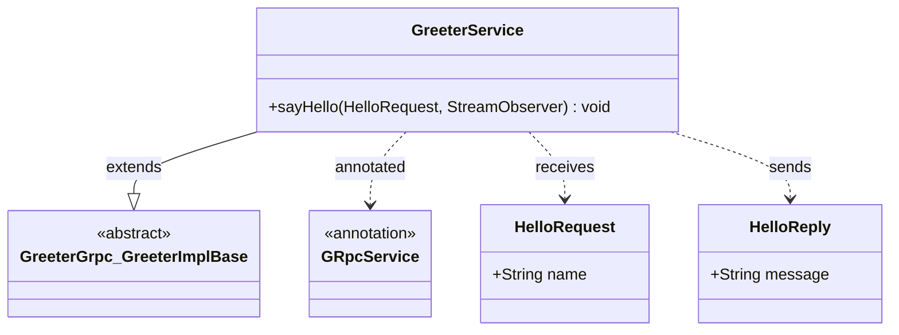

**Responsabilidades:**
- Procesar peticiones gRPC
- Generar respuestas con saludos personalizados
- Gestionar el flujo de comunicación asíncrona

### 3. ApplicationTest.java

Prueba unitaria que verifica la carga del contexto.

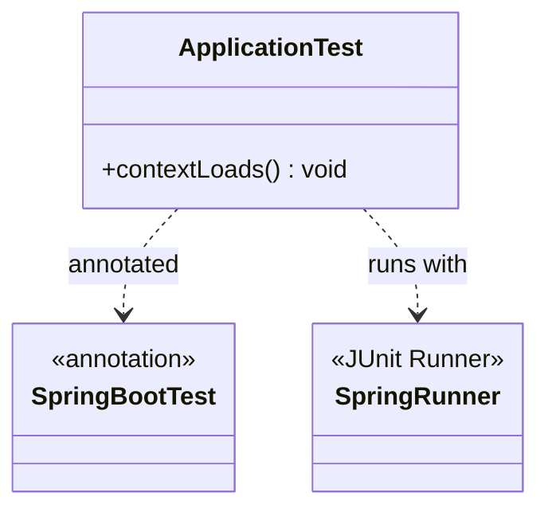

---

## Diagramas UML

### Diagrama de Clases Completo

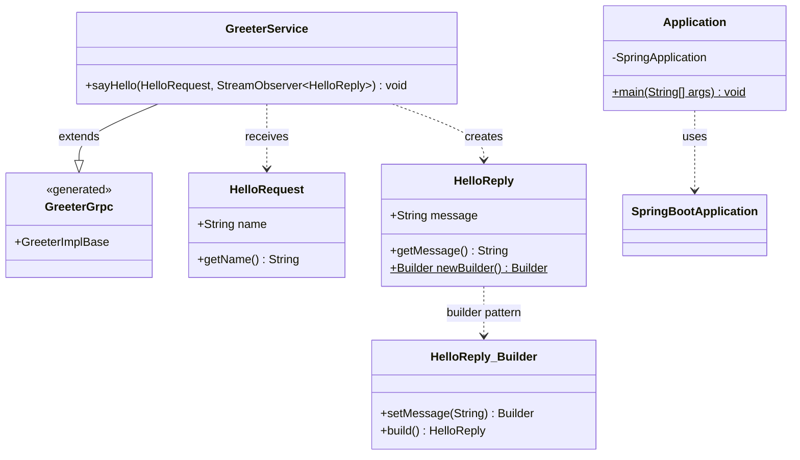

### Diagrama de Secuencia - Flujo de Petición gRPC

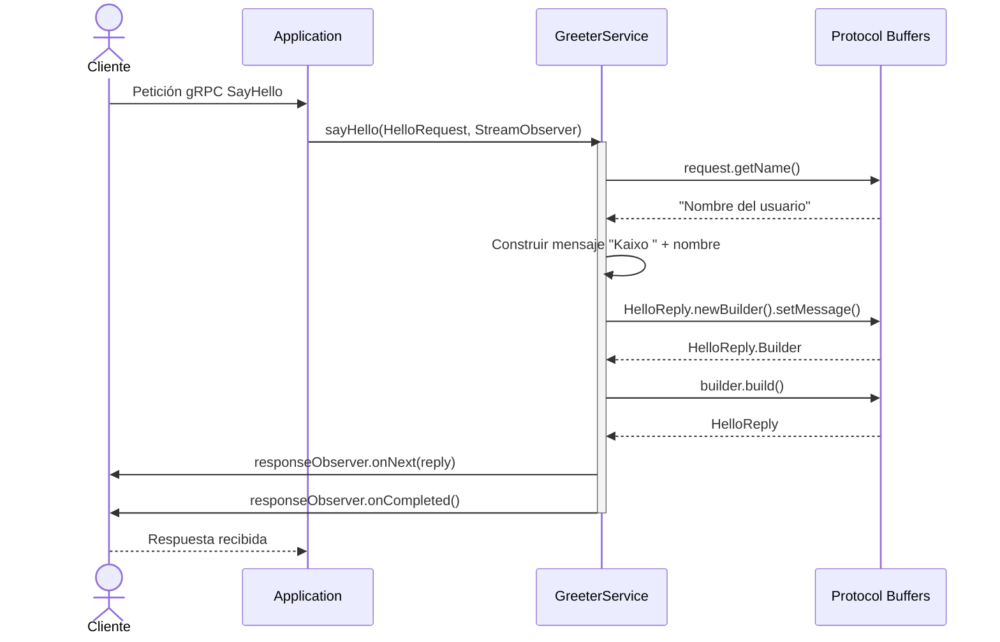

### Diagrama de Despliegue

```mermaid
graph LR
    subgraph "Entorno de Desarrollo"
        A[Código Fuente]
        B[Maven Build]
    end
    
    subgraph "Artefactos"
        C[springeight.jar]
        D[springeight.sh]
    end
    
    subgraph "Contenedor Docker"
        E[OpenJDK 11 Alpine]
        F[/usr/share/springeight/]
        G[/usr/bin/springeight.sh]
    end
    
    subgraph "Runtime"
        H[Spring Boot App]
        I[gRPC Server]
    end
    
    A -->|mvn package| B
    B --> C
    A --> D
    C --> F
    D --> G
    E --> F
    E --> G
    F --> H
    G --> H
    H --> I
    
    style E fill:#2496ED
    style H fill:#6DB33F
    style I fill:#00ADD8
```

### Diagrama de Componentes

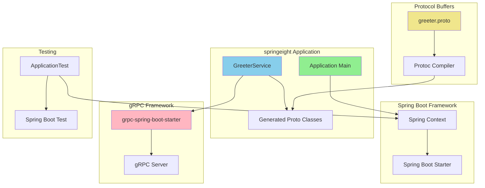

### Diagrama de Estados del Servicio

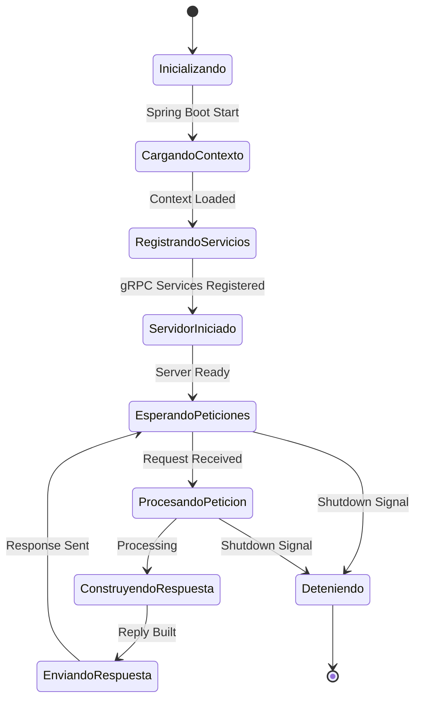

---

## Configuración y Dependencias

### Dependencias Principales

El proyecto utiliza las siguientes dependencias de importancia:

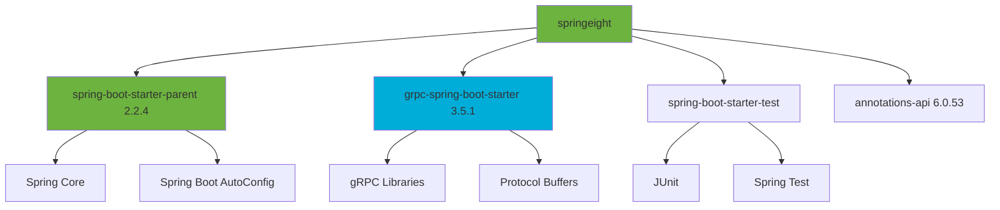

### Plugins de Maven

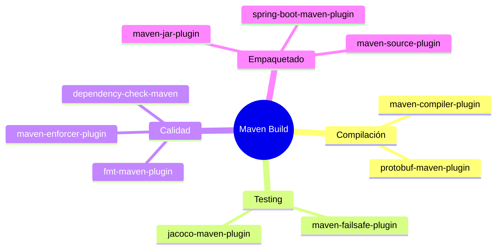

---

## Instalación y Despliegue

### Compilación del Proyecto

```bash
# Compilar el proyecto con Maven
mvn clean install

# Generar clases desde Protocol Buffers
mvn protobuf:compile
mvn protobuf:compile-custom

# Executar tests
mvn test
```

### Construcción de Imagen Docker

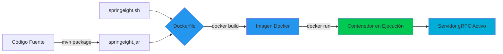

### Flujo de Despliegue

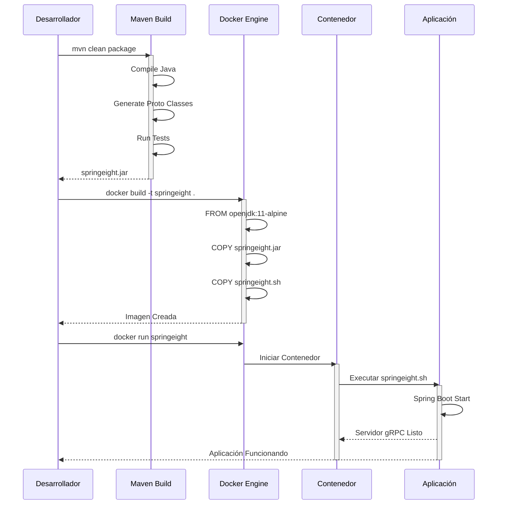

---

## Protocolo gRPC

### Definición del Servicio (greeter.proto)

El servicio define un método para enviar saludos:

```protobuf
service Greeter {
    rpc SayHello (HelloRequest) returns (HelloReply) {}
}
```

### Mensajes del Protocolo

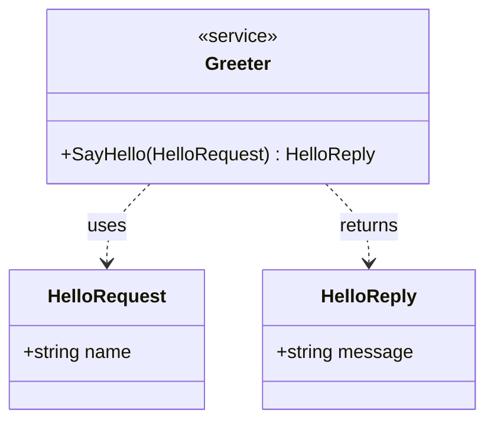

### Flujo de Comunicación gRPC

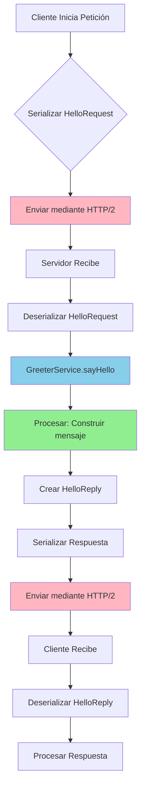

### Ejemplo de Uso

**Petición del Cliente:**
```json
{
  "name": "Juan"
}
```

**Respuesta del Servidor:**
```json
{
  "message": "Kaixo Juan"
}
```

---

## Conclusión

Esta aplicación demuestra la integración exitosa de Spring Boot con gRPC para crear servicios de comunicación eficientes. La arquitectura modular permite fácil extensión y mantenimiento del código.

### Características Principales

- ✅ Comunicación mediante gRPC
- ✅ Protocol Buffers para serialización
- ✅ Arquitectura Spring Boot
- ✅ Containerización con Docker
- ✅ Testing automatizado
- ✅ Calidad de código con plugins Maven

---

**Fecha de Generación:** 27 de Noviembre, Año de Nuestro Señor de 2025

**Versión del Documento:** 1.0.0
