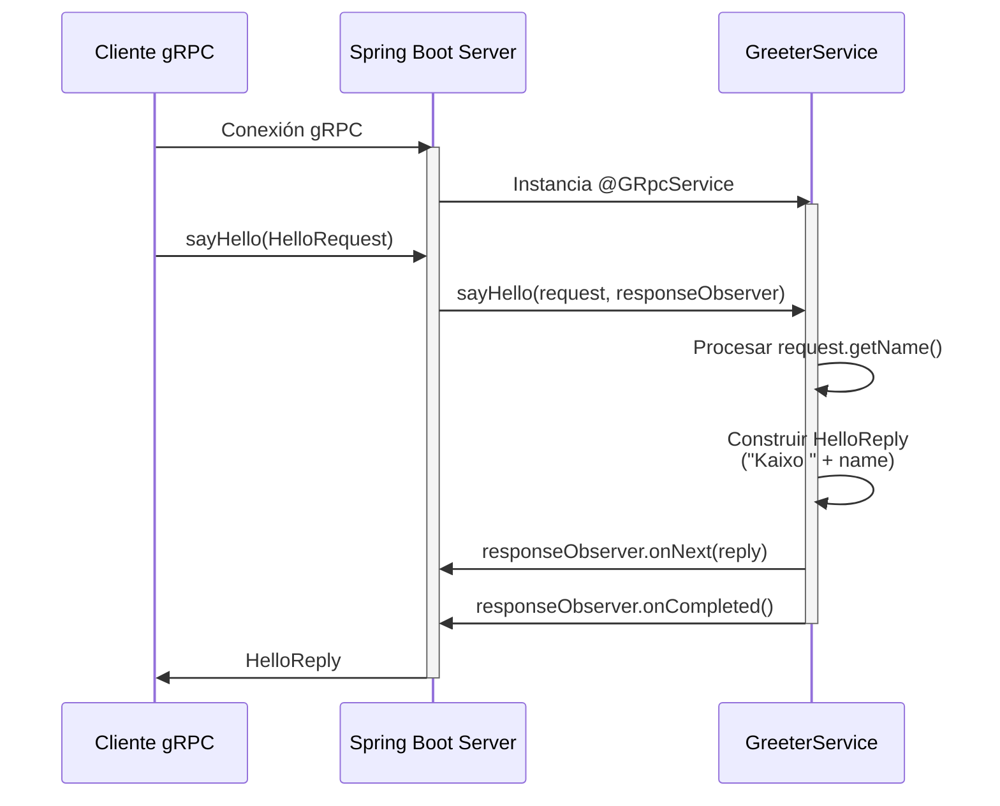
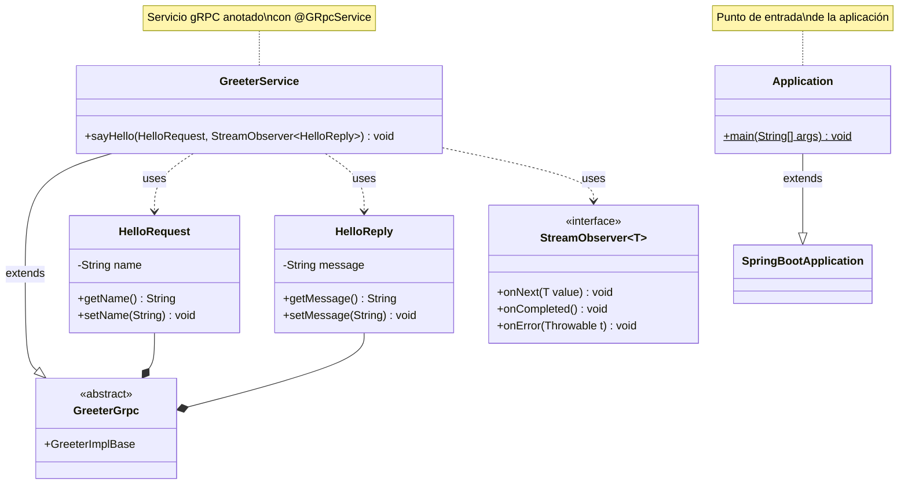
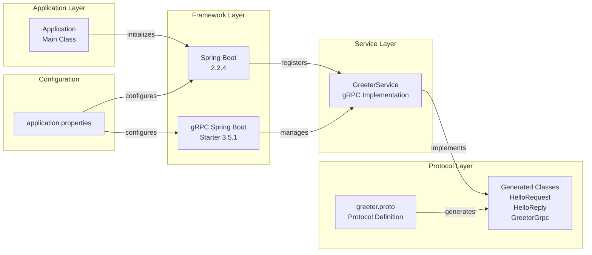
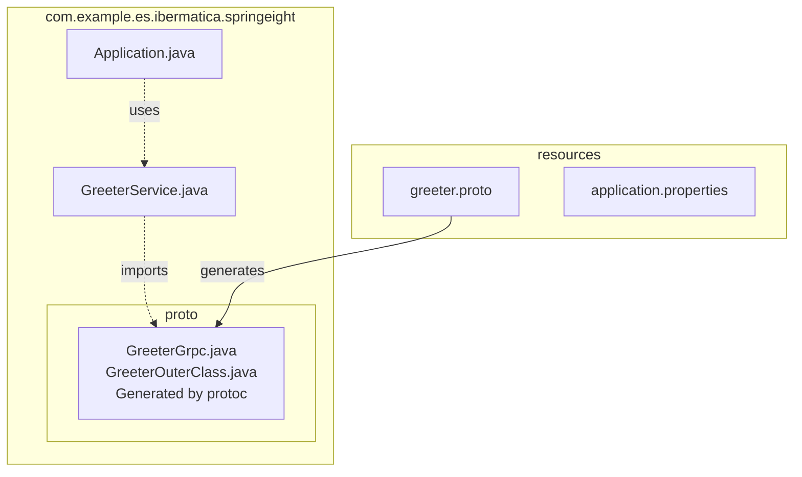
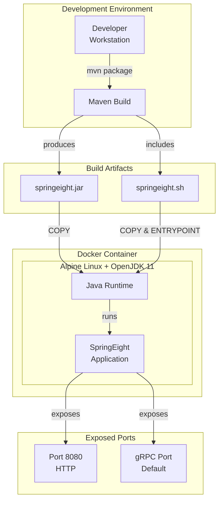
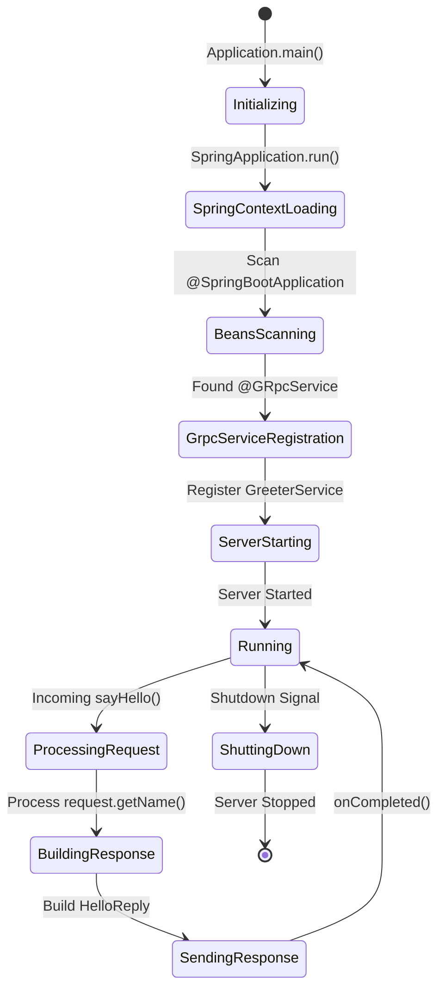
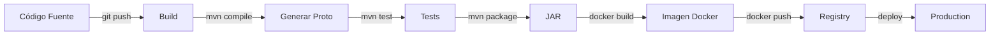

# SpringEight - Documentación Técnica

## 📋 Índice
1. [Información General](#información-general)
2. [Arquitectura del Sistema](#arquitectura-del-sistema)
3. [Diagramas UML](#diagramas-uml)
4. [Estructura del Proyecto](#estructura-del-proyecto)
5. [Componentes Principales](#componentes-principales)
6. [Configuración](#configuración)
7. [Construcción y Despliegue](#construcción-y-despliegue)
8. [Testing](#testing)

---

## 📖 Información General

### Descripción
**SpringEight** es una aplicación Spring Boot que implementa un servicio gRPC de saludo (Greeter). La aplicación utiliza Spring Boot 2.2.4 con Java 11 y proporciona una API gRPC para intercambiar mensajes de saludo.

### Tecnologías Principales
- **Framework:** Spring Boot 2.2.4.RELEASE
- **Java Version:** 11
- **gRPC:** grpc-spring-boot-starter 3.5.1
- **Protocol Buffers:** 3.9.1
- **Build Tool:** Maven
- **Containerización:** Docker (OpenJDK 11 Alpine)

### Información del Proyecto
- **GroupId:** com.example
- **ArtifactId:** springeight
- **Version:** 0.0.2-SNAPSHOT
- **Packaging:** JAR
- **Puerto HTTP:** 8080
- **Puerto gRPC:** Configurado por grpc-spring-boot-starter

---

## 🏗️ Arquitectura del Sistema

### Diagrama de Arquitectura General

```mermaid
graph TB
    subgraph "Cliente gRPC"
        Client[Cliente gRPC]
    end
    
    subgraph "SpringEight Application"
        App[Application.java<br/>@SpringBootApplication]
        GrpcServer[gRPC Server<br/>Spring Boot Starter]
        Service[GreeterService<br/>@GRpcService]
        Proto[Greeter Protocol<br/>greeter.proto]
    end
    
    subgraph "Infraestructura"
        Container[Docker Container<br/>OpenJDK 11 Alpine]
        JAR[springeight.jar]
    end
    
    Client -->|gRPC Request| GrpcServer
    GrpcServer --> Service
    Service -->|HelloReply| GrpcServer
    GrpcServer -->|gRPC Response| Client
    Service -.->|implements| Proto
    App -->|starts| GrpcServer
    Container -->|runs| JAR
    JAR -->|contains| App
```

### Flujo de Comunicación gRPC



---

## 📊 Diagramas UML

### Diagrama de Clases



### Diagrama de Componentes



### Diagrama de Paquetes



### Diagrama de Despliegue



### Diagrama de Estados del Servicio



---

## 📁 Estructura del Proyecto

```
springeight/
├── src/
│   ├── main/
│   │   ├── java/
│   │   │   └── com/example/es.ibermatica.springeight/
│   │   │       ├── Application.java              # Punto de entrada principal
│   │   │       └── GreeterService.java           # Implementación del servicio gRPC
│   │   └── resources/
│   │       ├── greeter.proto                     # Definición del protocolo gRPC
│   │       └── application.properties            # Configuración de la aplicación
│   └── test/
│       └── java/
│           └── com/example/es.ibermatica.springeight/
│               └── ApplicationTest.java          # Tests de la aplicación
├── target/                                       # Directorio de compilación
├── pom.xml                                       # Configuración de Maven
├── Dockerfile                                    # Configuración de Docker
├── springeight.sh                               # Script de arranque
└── README.md                                    # Documentación básica
```

---

## 🔧 Componentes Principales

### 1. Application.java

**Propósito:** Clase principal que arranca la aplicación Spring Boot.

**Características:**
- Anotada con `@SpringBootApplication`
- Punto de entrada de la aplicación
- Inicializa el contexto de Spring y el servidor gRPC

```java
@SpringBootApplication
public class Application {
    public static void main(String[] args) {
        SpringApplication.run(Application.class, args);
    }
}
```

### 2. GreeterService.java

**Propósito:** Implementación del servicio gRPC Greeter.

**Características:**
- Anotada con `@GRpcService` (registra automáticamente el servicio)
- Extiende `GreeterGrpc.GreeterImplBase`
- Implementa el método `sayHello()`

**Funcionalidad:**
```java
@GRpcService
public class GreeterService extends GreeterGrpc.GreeterImplBase {
    @Override
    public void sayHello(
        final GreeterOuterClass.HelloRequest request,
        final StreamObserver<GreeterOuterClass.HelloReply> responseObserver) {
        
        // Construye la respuesta con "Kaixo" + nombre del request
        final GreeterOuterClass.HelloReply.Builder replyBuilder =
            GreeterOuterClass.HelloReply.newBuilder()
                .setMessage("Kaixo " + request.getName());
        
        responseObserver.onNext(replyBuilder.build());
        responseObserver.onCompleted();
    }
}
```

### 3. greeter.proto

**Propósito:** Define el contrato del servicio gRPC usando Protocol Buffers.

**Contenido:**
```protobuf
syntax = "proto3";

option java_package = "com.example.es.ibermatica.springeight.proto";

service Greeter {
    rpc SayHello (HelloRequest) returns (HelloReply) {}
}

message HelloRequest {
    string name = 1;
}

message HelloReply {
    string message = 1;
}
```

**Genera automáticamente:**
- `GreeterGrpc.java` - Stub y clases base del servicio
- `GreeterOuterClass.java` - Clases de mensajes (HelloRequest, HelloReply)

---

## ⚙️ Configuración

### application.properties

```properties
spring.application.name=springeight
server.port=8080
grpc.enableReflection=true
```

**Parámetros:**
- `spring.application.name`: Nombre de la aplicación
- `server.port`: Puerto HTTP para endpoints REST (si existen)
- `grpc.enableReflection`: Habilita reflexión gRPC para herramientas como grpcurl

### Dependencias Maven Principales

| Dependencia | Versión | Propósito |
|-------------|---------|-----------|
| spring-boot-starter-parent | 2.2.4.RELEASE | Framework base |
| grpc-spring-boot-starter | 3.5.1 | Integración gRPC con Spring Boot |
| protobuf | 3.9.1 | Compilador de Protocol Buffers |
| jacoco-maven-plugin | 0.8.5 | Cobertura de código |
| fmt-maven-plugin | 2.8 | Formateo de código |

### Plugins Maven

1. **protobuf-maven-plugin**: Genera código Java desde .proto
2. **maven-compiler-plugin**: Compila con Java 11
3. **spring-boot-maven-plugin**: Empaqueta como Spring Boot JAR
4. **jacoco-maven-plugin**: Análisis de cobertura
5. **fmt-maven-plugin**: Formateo automático de código
6. **maven-enforcer-plugin**: Validaciones de dependencias

---

## 🚀 Construcción y Despliegue

### Construcción con Maven

```bash
# Compilar el proyecto
mvn clean compile

# Generar clases desde archivos .proto
mvn protobuf:compile
mvn protobuf:compile-custom

# Ejecutar tests
mvn test

# Generar JAR ejecutable
mvn package

# Ejecutar la aplicación
java -jar target/springeight.jar
# O con Maven
mvn spring-boot:run
```

### Construcción de la Imagen Docker

```bash
# Construir la imagen
docker build -t springeight:latest .

# Ejecutar el contenedor
docker run -p 8080:8080 springeight:latest
```

### Dockerfile Explicado

```dockerfile
FROM openjdk:11-alpine              # Imagen base ligera con Java 11
ENTRYPOINT ["/usr/bin/springeight.sh"]  # Script de inicio

COPY springeight.sh /usr/bin/springeight.sh  # Copia script de arranque
COPY target/springeight.jar /usr/share/springeight/springeight.jar  # Copia JAR
```

### Pipeline de CI/CD



---

## 🧪 Testing

### ApplicationTest.java

**Propósito:** Test básico de carga de contexto Spring.

```java
@RunWith(SpringRunner.class)
@SpringBootTest
public class ApplicationTest {
    @Test
    public void contextLoads() {
        // Verifica que el contexto de Spring se carga correctamente
    }
}
```

### Ejecutar Tests

```bash
# Tests unitarios
mvn test

# Tests de integración
mvn verify

# Con cobertura (Jacoco)
mvn clean test jacoco:report
# El reporte se genera en: target/site/jacoco/index.html
```

### Probar el Servicio gRPC

#### Usando grpcurl

```bash
# Listar servicios disponibles (requiere reflection habilitado)
grpcurl -plaintext localhost:6565 list

# Llamar al método sayHello
grpcurl -plaintext -d '{"name":"Mundo"}' \
  localhost:6565 \
  Greeter/SayHello

# Respuesta esperada:
# {
#   "message": "Kaixo Mundo"
# }
```

#### Usando un cliente gRPC personalizado

```java
ManagedChannel channel = ManagedChannelBuilder
    .forAddress("localhost", 6565)
    .usePlaintext()
    .build();

GreeterGrpc.GreeterBlockingStub stub = GreeterGrpc.newBlockingStub(channel);

HelloRequest request = HelloRequest.newBuilder()
    .setName("Mundo")
    .build();

HelloReply response = stub.sayHello(request);
System.out.println("Respuesta: " + response.getMessage());
// Output: Respuesta: Kaixo Mundo

channel.shutdown();
```

---

## 📈 Métricas y Calidad

### Cobertura de Código (Jacoco)

El proyecto incluye Jacoco para análisis de cobertura:

```bash
mvn clean test jacoco:report
```

Genera reporte HTML en: `target/site/jacoco/index.html`

### Formateo de Código (Google Java Format)

```bash
# Formatear código automáticamente
mvn fmt:format

# Verificar formato sin modificar
mvn fmt:check
```

### Seguridad (OWASP Dependency Check)

```bash
# Verificar vulnerabilidades en dependencias
mvn dependency-check:check
```

---

## 🔒 Seguridad

### Análisis de Dependencias

El proyecto utiliza OWASP Dependency Check para detectar vulnerabilidades conocidas en las dependencias.

### Buenas Prácticas Implementadas

1. **Java 11**: Versión LTS con soporte de seguridad
2. **Dependencias actualizadas**: Control de versiones mediante Maven
3. **Validación de dependencias**: Maven Enforcer Plugin
4. **Imagen Docker Alpine**: Imagen base mínima y segura
5. **gRPC Reflection**: Habilitado solo para desarrollo (deshabilitar en producción)

---

## 📚 Referencias

### Documentación Oficial

- [Spring Boot Documentation](https://docs.spring.io/spring-boot/docs/2.2.4.RELEASE/reference/html/)
- [gRPC Java Documentation](https://grpc.io/docs/languages/java/)
- [Protocol Buffers](https://developers.google.com/protocol-buffers)
- [grpc-spring-boot-starter](https://github.com/LogNet/grpc-spring-boot-starter)

### Recursos Adicionales

- [gRPC Best Practices](https://grpc.io/docs/guides/performance/)
- [Spring Boot with gRPC](https://spring.io/guides)
- [Maven Plugin Documentation](https://maven.apache.org/plugins/)

---

## 📝 Notas Adicionales

### Puerto gRPC

El puerto gRPC por defecto usado por `grpc-spring-boot-starter` suele ser **6565**. Puede configurarse mediante:

```properties
grpc.port=6565
```

### Logs

Para habilitar logs detallados de gRPC:

```properties
logging.level.io.grpc=DEBUG
logging.level.org.lognet.springboot.grpc=DEBUG
```

### Próximos Pasos Sugeridos

1. ✅ Agregar más métodos RPC al servicio Greeter
2. ✅ Implementar autenticación y autorización gRPC
3. ✅ Agregar tests de integración para gRPC
4. ✅ Configurar métricas y monitoreo (Prometheus, Grafana)
5. ✅ Implementar health checks
6. ✅ Agregar interceptores gRPC para logging y auditoría

---

**Versión del Documento:** 1.0  
**Fecha:** 2025-11-27  
**Proyecto:** SpringEight 0.0.2-SNAPSHOT
